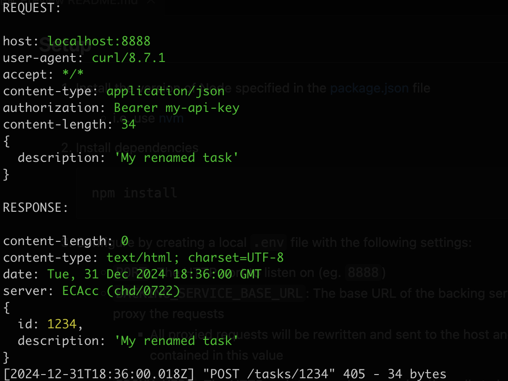

# http-post-proxy

A simple Node.js HTTP server proxies HTTP POST calls to another backing service as a different HTTP verb (eg. PUT, PATCH)

## Behavior

This simple HTTP server will wait for HTTP `POST` requests to any path on the server:

```http
POST /tasks/1234 HTTP/1.1
Host: LOCAL_HOST_NAME
Content-Type: application/json
Authorization: Bearer my-api-key

{"description": "My renamed task"}
```

When they occur, they are logged to the console in color:



And, based on configuration, the following `PUT` request is sent to the backing service

```http
PUT BACKING_SERVICE_BASE_PATH/tasks/1234 HTTP/1.1
Host: BACKING_SERVICE_HOST_NAME
Content-Type: application/json
Authorization: Bearer my-api-key

{"description": "My renamed task"}
```

## Setup

1. Install the version of Node specified in the [package.json](./package.json) file

   - i.e. use [nvm](https://github.com/nvm-sh/nvm)

1. Install dependencies

   ```sh
   npm install
   ```

1. Configure by creating a local `.env` file with the following settings:

   - `PORT`: The HTTP port to listen on (eg. `8888`)
   - `BACKING_SERVICE_BASE_URL`: The base URL of the backing service to which to proxy the requests
     - All proxied requests will be rewritten and sent to the host and path contained in this value
   - `PROXY_VERB`: The HTTP verb to use when proxying the calls to he backing service (eg. `PUT` or `PATCH`)

## Use

1. Run the server

   ```sh
   npm start
   ```

1. If needed, start a local proxy tool (such as `ngrok`) that will forward requests to an externally-accessible host to the local instance of `webhook-listener`:

   ```sh
   ngrok http http://localhost:8888
   ```

1. Test the proxy by sending a request:

   ```sh
   curl -X POST "https://$NGROK_DOMAIN/tasks/1234" \
     -H "Content-Type: application/json" \
     -H "Authorization: Bearer my-api-key" \
     -d '{"description": "My renamed task"}'
   ```
